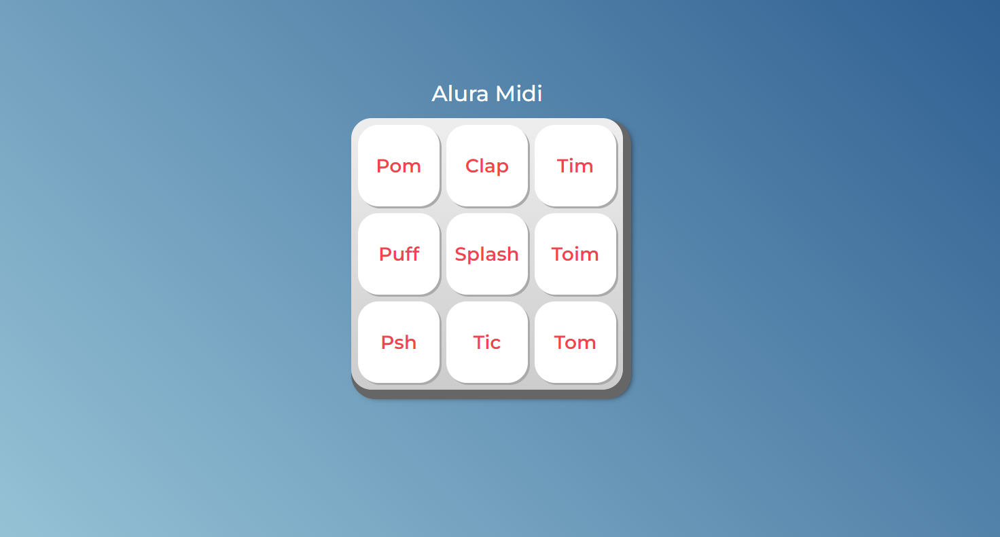
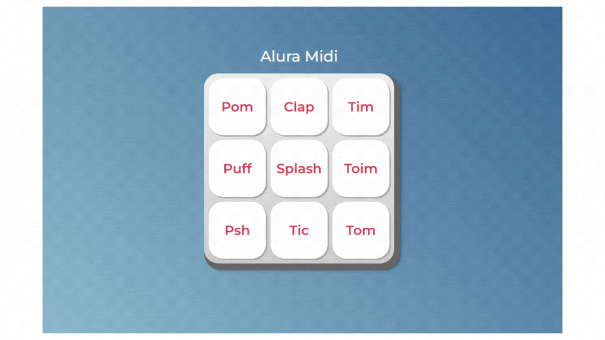

 
# Bem-vindo ao repositório AluraMidi!

Este repositório foi criado para aprender e praticar os conhecimentos adquirido no curso de JavaScript para Web.

## Tópicos de aprendizagem incluem:

- Identificar os papéis de cada tecnologia da Web para construção de páginas;
- Associar o JavaScript com HTML através do DOM;
- Implementar funções com JavaScript;
- Investigar possibilidades de resolução de problemas de código;
- Selecionar operadores lógicos adequados para diferentes situações;
- Produzir soluções simples para páginas dinâmicas;

## 🔨 Funcionalidades do projeto

## ✔️ Técnicas e tecnologias utilizadas

- `JavaScript`;

## 🛠️ Abrir e rodar o projeto

[Alura Midi](https://micheleascoli.github.io/aluramidi/)

## 📚 Mais informações do curso

Curso de JavaScript para Web: Crie páginas dinâmicas

Carga Horária: 10H

- [Alura](https://cursos.alura.com.br/course/javascript-web-paginas-dinamicas)